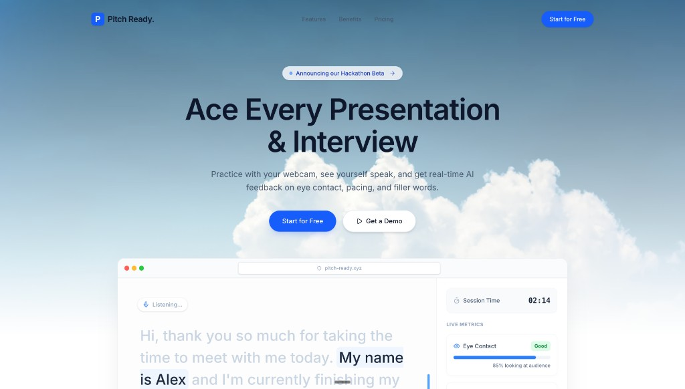

# Pitch Ready

A browser-based presentation rehearsal platform that helps students improve eye contact, pacing, clarity, and verbal delivery before graded presentations, interviews, and public speaking events.

Practice once inside a clean teleprompter environment, and immediately receive actionable feedback on how you spoke, where you looked, how fast you talked, and how often you relied on filler words.

## Live demo

**[https://pitch-ready.xyz](https://pitch-ready.xyz)**



## Features

- **Presentation mode** — Auto-scrolling teleprompter with adjustable font size and speed
- **Interview mode** — Job-aware mock interviews with optional AI-generated questions and answer feedback
- **Speech recognition** — Real-time transcription via the Web Speech API with rolling WPM calculation
- **Filler word detection** — Live tracking of common fillers (e.g. "um," "uh," "like," "basically," "you know")
- **Eye tracking** — Browser-based face landmarks via **MediaPipe** (`@mediapipe/tasks-vision`) to estimate camera engagement
- **Live HUD** — Real-time sidebar with eye contact %, speech pace, filler badges, and session timer
- **Post-session report** — Score circles, WPM timeline, filler breakdown, tips, transcript, and optional **Groq**-powered coaching
- **Attempt comparison** — Compare sessions with delta-style feedback

## Tech Stack

- **React 19** with TypeScript
- **Vite 6** for builds and dev server
- **Tailwind CSS v4** for styling
- **Motion** (Framer Motion) for animations
- **Recharts** for data visualization
- **React Router** for client-side routing
- **Web Speech API** for speech recognition
- **@mediapipe/tasks-vision** (Face Landmarker) for eye-contact estimation
- **Groq** (OpenAI-compatible API, `openai/gpt-oss-20b`) for optional AI interview and coaching features
- **Lucide React** for icons

## Getting Started

**Prerequisites:** Node.js 18+

```bash
# Install dependencies
npm install

# Start dev server
npm run dev
```

The app runs at `http://localhost:3000`.

For AI features in local development, set `GROQ_API_KEY` in `.env` (see `.env.example`). The Vite dev server can proxy chat requests so the key stays server-side.

## Project Structure

```
src/
├── App.tsx                     # Router setup
├── main.tsx                    # Entry point
├── index.css                   # Global styles + Tailwind
├── context/
│   └── SessionContext.tsx      # Session + interview state
├── hooks/
│   ├── useTimer.ts
│   ├── useSpeechRecognition.ts # Web Speech API
│   └── useEyeTracking.ts       # MediaPipe Face Landmarker
├── lib/
│   ├── analytics.ts            # Scores and tips
│   ├── openai.ts               # Groq chat completions + helpers
│   └── questions.ts            # Interview question bank (fallback)
└── pages/
    ├── Landing.tsx
    ├── ModeSelect.tsx
    ├── Setup.tsx / Session.tsx / Report.tsx
    ├── InterviewSetup.tsx / InterviewSession.tsx
    └── …                       # Tips, templates, blog, legal, Groq tutorial, etc.
```

## User Flow

1. Open **[pitch-ready.xyz](https://pitch-ready.xyz)** (or run locally) and choose **Start for Free**
2. Pick **Presentation** or **Interview** mode
3. Paste a script (or job details for interviews), adjust settings, grant camera and microphone if prompted
4. Practice with live feedback
5. End the session and review your report

## Browser Support

Speech recognition works best in **Chrome** or **Edge**. Eye tracking needs camera access and a WebGL-capable browser. The app degrades gracefully when a feature is unavailable.

## Scripts

| Command | Description |
|---|---|
| `npm run dev` | Start dev server on port 3000 |
| `npm run build` | Production build to `dist/` |
| `npm run preview` | Preview production build |
| `npm run lint` | TypeScript type checking |
| `npm run clean` | Remove `dist/` folder |
